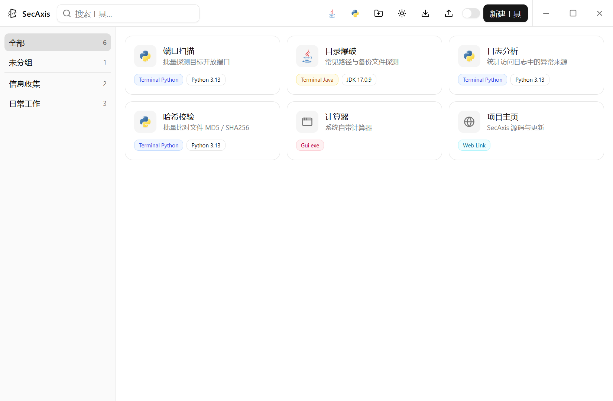
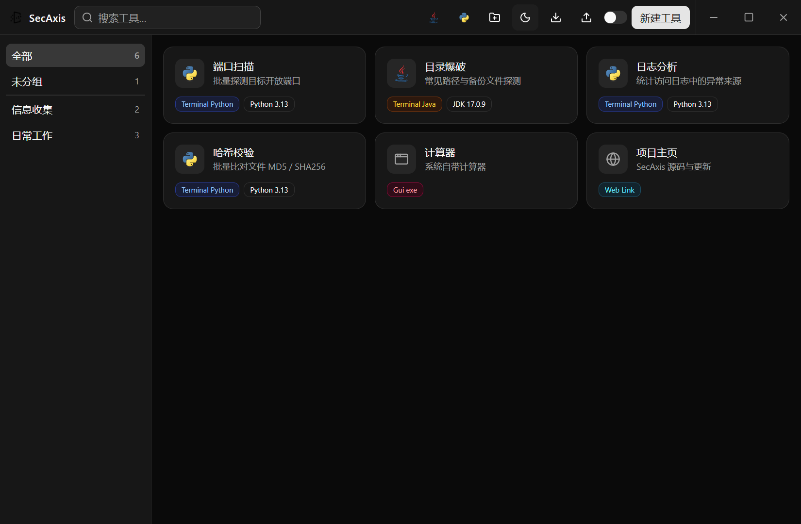

# SecAxis

<p align="left">
  
  
  
  
  
  
  
  <a href="https://github.com/gjskxiw/skoxhwha/releases/latest"></a>
</p>

把散落在各处的脚本、JAR 和绿色软件收进一个面板里统一启动的 Windows 工具箱。
**单文件、免安装、约 4.9 MB**，双击 `secaxis.exe` 即用。

---

## 为什么需要它

安全测试和日常运维里总有一堆"点了就跑"的东西：一个 Python 扫描脚本、几个工具 JAR、
若干绿色 exe。它们散在不同目录、依赖不同版本的运行时，参数里还全是空格和特殊符号。
SecAxis 把这些入口收进一张张小卡片：分组管理、搜索定位、双击启动，并强制你为每个
Java / Python 工具绑定确定的运行时版本。

## 功能

| 能力 | 说明 |
| --- | --- |
| 工具卡片 | 六种类型：终端 Python / 终端 Java / 终端 exe / GUI Java / GUI exe / 网页链接；双击启动，聚焦后回车或空格亦可。副行以「分组 · 描述」开头标出归属（分组色只留在侧栏），名称与副行截断后悬停可看全文 |
| 分组与搜索 | 侧栏「全部 / 未分组 / 自定义分组」带计数（空分组不显示），分组可挑一枚色标便于扫视；顶栏搜索同时匹配名称与描述；分组支持右键重命名与删除（删除时其中工具退回未分组） |
| 运行环境绑定 | Java / Python 类工具**必须**绑定手动配置的 JDK / Python，不再回退系统 `PATH`——系统里装着哪个版本不可控。顶栏一个「运行环境」按钮进弹窗，两类在弹窗内切换；新建工具时缺一套环境可就地添加并自动选上 |
| 环境自动识别 | 添加环境时选目录即可，后台跑一次 `java -version` / `python --version`，用版本信息自动命名（如 `JDK 17.0.9`、`Python 3.12.4`），校验不过就不入库 |
| 参数安全 | 参数按 token 逐个引用传递，含空格的值不会丢，`& \| ; >` 只会成为参数内容 |
| 提权运行 | 仅 GUI exe 类型支持右键「以管理员身份运行」，走 `ShellExecuteEx` 触发 UAC，取消时有明确提示 |
| 自动图标 | GUI exe 自动从目标文件提取图标存成 PNG（文件名取路径哈希）；其它类型回退到内置图座，只表达「终端 / 窗口 / 网页」，语言由彩色类型徽章承担 |
| 依赖自检 | 启动前逐项检查文件是否存在、类型与扩展名是否匹配、环境是否绑定，问题直接标红在卡片上并给出原因，而不是点了才失败 |
| 结果反馈 | 不用浮动通知：失败与关键结果收在窗口底部一条状态条里（自动收起，也可手动关），同一时刻只显示最新一条；表单 / 环境 / 分组的校验不通过时在弹窗内就地标红；完整原因写进 `data\logs\app.log`，托盘菜单有「打开日志文件」直达 |
| 托盘常驻 | 托盘菜单按分组列出全部工具、可直接启动；左键单击唤出主窗口；再次启动程序会唤起已有实例而非开第二个 |
| 主题 | 浅色 / 深色一键切换并持久化，切换瞬间禁用过渡以避免闪色 |
| 配置便携 | 数据写在 exe 同目录 `data\`；该目录不可写时自动回退 `%APPDATA%\SecAxis\data`；支持导出 / 导入 JSON |
| 无边框窗口 | 自绘标题栏、整条可拖拽、双击切换最大化；记住上次尺寸与最大化状态，启动一律屏幕居中 |

## 界面

卡片按工具类型着色，副行开头标出所属分组，绑定过运行环境的会额外挂一枚环境徽章；悬停时整卡轻微上浮并加深描边，依赖有问题时卡片描红并给出原因。

浅色主题：



深色主题：



## 技术栈

| 层 | 选型 | 备注 |
| --- | --- | --- |
| 桌面框架 | **Tauri 2**（Rust） | 开启 `tray-icon`；插件 `dialog` / `opener` / `single-instance` |
| 界面 | **Vue 3.5** + `<script setup>` | 无路由、无状态库，一个 `reactive` store 足够 |
| 语言 | **TypeScript 6** | 前后端数据结构一一对应，类型定义集中在 `src/lib/types.ts` |
| 构建 | **Vite 8** + `vue-tsc` | `pnpm build` 先做类型检查再打包 |
| 样式 | **Tailwind CSS 4** + `tw-animate-css` | 主题走 CSS 变量（oklch），深浅色一套组件通吃 |
| 无头组件 | **reka-ui** + shadcn-vue（new-york / neutral） | `src/components/ui/` 为生成件，业务组件在其上组合 |
| 图标 | **@lucide/vue** | 界面图标与卡片图座，不引入第三方语言 logo |
| 后端 | **Rust**（edition 2021） | `serde` / `serde_json` / `base64` / `image`(仅 png) |
| Win32 | **windows-sys 0.60** | `Shell` / `WindowsAndMessaging` / `Gdi` / `Registry`，用于取图标与提权启动 |
| 产物 | 单个 `secaxis.exe` | `lto = true`、`codegen-units = 1`、`opt-level = 3`、`panic = "abort"`、`strip = true` |

分工原则：**前端只负责画界面与交互，一切落地动作（启动进程、读写配置、取图标、开目录）都在 Rust 侧完成**，
前端只传工具 id，不传路径或命令行。

## 启动链路

工具类型决定走哪条路，参数引用策略也随之不同：

```
双击卡片 → launch_tool(id, asAdmin)
   ├─ web          → opener.open_url（仅接受 http / https）
   ├─ terminal_*   → cmd.exe /K  set "PATH=<环境bin>;%PATH%" && cd /d "<工作目录>" && "<程序>" "<参数>"…
   ├─ gui_java     → CreateProcess  javaw.exe  [JVM 参数] -jar <包> [程序参数]…
   ├─ gui_exe      → CreateProcess  <exe> <参数>…            （current_dir = 目标所在目录）
   └─ gui_exe 提权 → ShellExecuteEx runas + 逐参数 CommandLineToArgvW 引用
```

终端类必须经过 cmd，因为「保留窗口」和「临时把绑定环境的 `bin` 置顶 `PATH`」这两件事只有 cmd 能做。
代价是参数会被 cmd 再解析一次——所以这一路的整行文本由 `terminal_cmd_line()` 自己拼，
程序与每个参数都强制包上双引号（`quote_windows_arg_forced`），标准库不再叠加引用。
引号压不住的字符则直接拒绝：`%`（cmd 先展开变量、再解析特殊字符，会污染后续 token）、
双引号本身、以及换行。因此 `-sV & echo x > f` 这类参数只会原样到达目标进程。

## 配置与数据

```
data\
├─ config.json        工具 / 分组 / 环境 / 设置（唯一真源，pretty JSON）
├─ config.json.bak    覆盖写入前的滚动备份，主文件损坏时自动兜回
├─ window.json        窗口尺寸与最大化状态（独立存，避免被整体保存 config 时覆盖）
├─ icons\             从 exe 提取的 PNG 图标，文件名 = 目标路径哈希
└─ logs\app.log       关键错误与事件，超 1 MB 轮转为 app.log.1
```

写入一律走「临时文件 → 写入 → `sync_all` → `rename`」的原子路径，避免断电留下 0 字节或半截 JSON。
读取时枚举做容错（`#[serde(other)]`）：单个不认识的枚举值只会降级为 `Unknown` 并标红该卡片，
不会让整份配置被判损坏、把用户工具列表清空。

## 安全设计

- **参数不拼 Shell**：GUI 类直接 `CreateProcess`；终端类逐 token 强制引用 + 拒绝 `%` / 不成对引号
- **路径字段 fail-closed**：会进入命令行的字段（环境路径、目标路径）含引号 / 换行 / `%` 时拒绝执行
- **导入即校验**：导入的 JSON 属外部输入——限制扩展名与体积、剔除非法环境路径并同步摘掉其引用、
  收敛悬空与重复 id，所有修正逐条回报给界面，不静默改写
- **提权范围最小**：`asAdmin` 是右键的一次性动作而非持久属性，后端二次校验类型，仅 GUI exe 可提权
- **URL 白名单**：网页类型只接受 `http://` / `https://`，挡掉 `file://` 之类
- **CSP 收紧**：`default-src 'self'`、`object-src 'none'`、`base-uri 'self'`，图片仅同源与 `data:`
- **capability 最小化**：前端只拿到窗口最小化 / 最大化 / 关闭 / 拖拽与对话框权限，其余动作无入口
- **图标名校验**：读取图标文件前拒绝路径分隔符与 `..`

## 快速上手

1. 到 [Releases](https://github.com/gjskxiw/skoxhwha/releases/latest) 下载 `secaxis.exe`，放到任意目录双击
2. 顶栏 **Java 环境 / Python 环境** → 添加 → 选目录（JDK 选根目录，Python 选 `python.exe` 所在目录），自动校验并命名
3. 右上角 **新建工具** → 选类型、填目标文件、按需绑定运行环境与启动参数 → 保存
4. 双击卡片启动；右键可编辑、打开工作目录、删除（GUI exe 另有「以管理员身份运行」）

## 构建

需要 Node.js、pnpm 与 Rust（MSVC 工具链）。

```bash
pnpm install
pnpm check:version   # 校验 package.json / tauri.conf.json / Cargo.toml 三处版本号一致
pnpm dev             # 仅前端（Vite，端口 1420）
pnpm tauri dev       # 带后端的开发运行
pnpm tauri build     # 产物：src-tauri/target/release/secaxis.exe（约 4.9 MB）
cargo test --lib     # 在 src-tauri/ 下运行后端单元测试
```

`check:version` 已挂在 `build` 脚本最前面，所以 `pnpm tauri build` 会先拦下版本号不一致的提交。
产物是绿色单文件，不生成安装包（`bundle.targets` 为空）。发布时把 exe 作为 GitHub Release 附件上传，
不入库（`release/` 已被 `.gitignore` 忽略，只作上传前的暂存目录）。

## 注意事项

- 仅支持 Windows；未做多语言界面，文案为中文
- 终端类工具的启动参数不能含 `%`，双引号必须成对——表单会当场提示，已存的配置则会在卡片上标红说明
- Java / Python 类工具不绑定环境就无法启动，这是有意为之
- 若把 exe 移到只读目录，配置会自动落到 `%APPDATA%\SecAxis\data`，启动日志里会记下实际使用的数据目录

## 许可

本项目**仅供内部使用，不授予任何公开许可**：未经许可不得复制、修改、分发或出售，详见 [LICENSE](LICENSE)。

上文界面截图中的工具、分组与运行环境均为演示数据，不对应任何真实目标。
